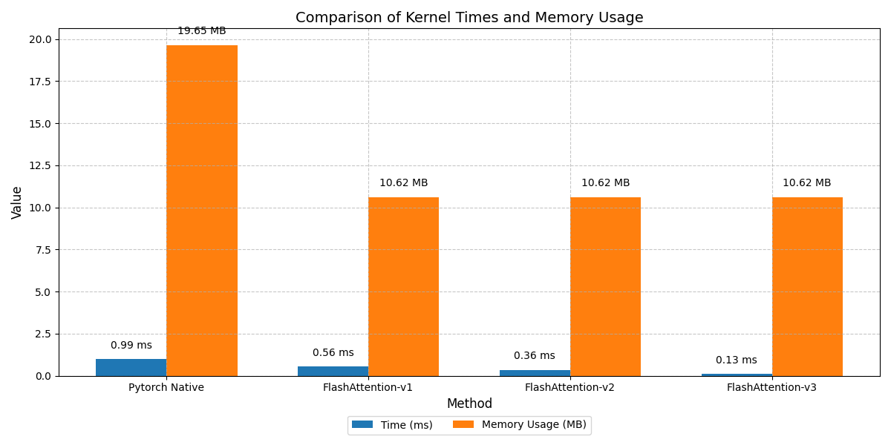
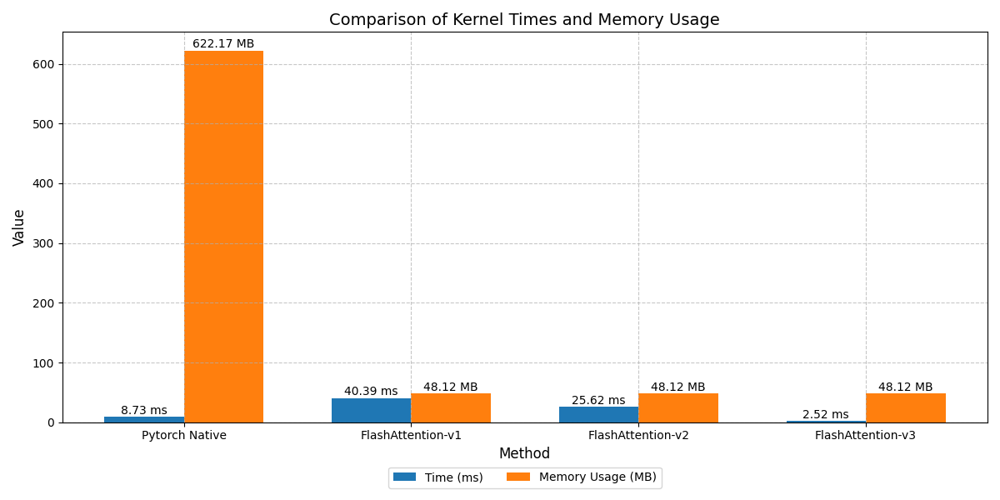

# Triton-Optimized Flash Attention: From Naive to System2

This repository is an educational yet hardcore exploration of **FlashAttention** built from scratch using OpenAI's Triton. It documents the architectural evolution from a naive block-wise implementation to a highly optimized, hardware-aware System2 kernel. 

> **Note:** This is a research/educational repository intended to dissect the underlying system mechanics (SRAM allocation, Epilogue Normalization, FP8 Tensor Cores) rather than a production drop-in replacement. 

## 📂 Repository Structure

The project is modularized into the two fundamental phases of LLM generation:

```text
Triton-FlashAttention/
├── prefill/                # Kernels for processing long prompts (Compute-Bound)
│   ├── flash_attention_v1.py   # Naive implementation
│   ├── flash_attention_v2.py   # Epilogue Normalization
│   └── flash_attention_v3.py   # TMA & FP8 (Ampere/Hopper)
├── decoding/               # Kernels for autoregressive generation (Memory-Bound)
│   └── flash_decoding_v1.py    # Split-K parallelization & 2-stage reduction
├── run_prefill_bench.py    # Benchmark suite for Prefill TFLOPs
└── run_decoding_bench.py   # Benchmark suite for Decoding Bandwidth
```

## 🚀 Architectural Evolution

This repo contains three distinct implementations, each solving critical system-level bottlenecks:

- **v1: Basic 2D Grid & Online Softmax**
  - **Concept:** Implements standard Online Softmax.
  - **Bottleneck:** Performs "Fully Normalized" Softmax inside the inner loop, suffering from extreme ALU latency due to repetitive division instructions. Statically limits tile sizes, leading to L2 Cache thrashing on long sequences.
- **v2: Multi-Head & Epilogue Normalization (The "System2" Shift)**
  - **Fixes:** Resolves the mathematical *Double Division* bug. Removes division from the inner loop entirely.
  - **Optimization:** Implements **Deferred Normalization**. The kernel only maintains unnormalized numerators in SRAM and delays the final division (`acc / l_final`) until the very end (Epilogue), unlocking massive instruction-level parallelism.
- **v3: FP8 Tensor Cores & Block Prefetching**
  - **Optimization:** Replaces naive on-the-fly dynamic quantization (which stalls the GPU pipeline via block reductions) with static scaling logic. 
  - **Hardware Mechanics:** Utilizes Triton's `tl.advance` block pointers for zero-overhead prefetching and casts data to `float8_e5m2` for maximum Tensor Core utilization.
- **Decoding: Flash-Decoding (Split-K Attention)**
  - **Bottleneck:** Autoregressive generation (Q=1) is heavily Memory-Bound. Standard attention leaves the majority of SMs starved.
  - **Optimization:** Partitions the massive KV cache across the sequence dimension (Split-K), forcing parallel memory loads across all SMs, followed by a mathematically rigorous 2-stage Global LogSumExp reduction.


## 🎯 Addressing the Long-Context Decoding Bottleneck
In autoregressive decoding, traditional attention becomes severely Memory-Bound as the sequence length grows. On a legacy Pascal GPU (GTX 1080 Ti, Theoretical Bandwidth ~484 GB/s) with a massive 64K Context Window, PyTorch native GEMV throughput degrades significantly.

Our Split-K Triton kernel sustains ~360 GB/s bandwidth (74% of theoretical hardware limit), delivering a massive throughput rescue for extreme long-context generation by distributing the workload across all 28 SMs.

| Context Length        | Implementation  | Time (ms)| Bandwidth (GB/s)  | Note |
|-----------------------|------------|--------------|-----------|------|
| 8K (Medium)        | PyTorch Native      | 0.331       | 202.47         | CuBLAS GEMV baseline |
| 8K (Medium)     | **Flash Decoding (Split-K)**    | **0.195**        | **344.72**      | SM occupancy maximized |
| 64K (Extreme)     | PyTorch Native     | 3.867        | 138.84      | Single-SM starvation |
| 64K (Extreme) | **Flash Decoding (Split-K)** | **1.494** | **359.46** | 2.5x Speedup, sustained bandwidth |

## ⚡ Benchmark Results

Results executed on an NVIDIA GPU. Performance dramatically scales with sequence length due to hardware I/O limits and arithmetic intensity.

> **⚙️ Hardware Note (Hyperparameter Tuning):** > The performance metrics (TFLOPs/Bandwidth) and the optimal hyperparameter configurations (e.g., `BLOCK_M`, `BLOCK_N`, `num_warps`, `num_stages`) are strictly coupled with the specific GPU architecture (e.g., Ampere vs. Hopper) and its L2 Cache/SRAM capacity. To maximize Hardware Flops Utilization (HFU) on your specific machine, you must tune these parameters accordingly.

### Extreme Context (Seq Len: 8192, D_Model: 256, Heads: 16)
At 8K context (Arithmetic Intensity: 2048 FLOPs/Byte), PyTorch crashes into the Memory Wall (allocating over 600MB). Meanwhile, v3 crushes the baseline with a **16x speedup over v1 naive implementation** and operates at over 13 TFLOPs, utilizing hardware prefetching to hide memory latency.

| Implementation        | Time (ms)  | Peak Mem (MB)| TFLOPs/s  | Note |
|-----------------------|------------|--------------|-----------|------|
| PyTorch Native        | 8.732      | 622.17       | -         | HBM Bandwidth Bound / Memory Wall |
| FlashAttention-v1     | 40.392     | 48.12        | 0.85      | Small block size causing L2 cache thrashing |
| FlashAttention-v2     | 25.623     | 48.12        | 1.34      | Epilogue Normalization kicks in |
| **FlashAttention-v3** | **2.525** | **48.12** | **13.61** | FP8 Tensor Cores + Prefetching dominates |

### Standard Context (Seq Len: 1024, D_Model: 128, Heads: 8)
At 1K context (Arithmetic Intensity: 256 FLOPs/Byte), the operation is heavily Memory-Bound. Efficient SRAM usage and instruction-level parallelism in v3 still yield substantial latency reductions.

| Implementation        | Time (ms)  | Peak Mem (MB)| TFLOPs/s  |
|-----------------------|------------|--------------|-----------|
| PyTorch Native        | 1.205      | 19.65        | -         |
| FlashAttention-v1     | 0.559      | 10.62        | 0.48      |
| FlashAttention-v2     | 0.355      | 10.62        | 0.76      |
| **FlashAttention-v3** | **0.127** | **10.62** | **2.12** |
## 🛠️ Key System Optimizations Showcased

**1. Epilogue Normalization (Killing the Inner-Loop Division):**
```python
# INNER LOOP: No division allowed. Maintain unnormalized weights.
p = beta  
acc = acc * alpha[:, None] + tl.dot(p, v)


# ... [Loop Ends] ...

# EPILOGUE: Single division before writing to HBM
acc = acc / l_final[:, None]
```

2. Asynchronous Block Pointers (v3):

```Python
# Utilizing TMA (Tensor Memory Accelerator) patterns conceptually
k_block_ptr = tl.advance(k_block_ptr, (BLOCK_N, 0))
v_block_ptr = tl.advance(v_block_ptr, (BLOCK_N, 0))
```

# 📦 Usage
Installation
Requires PyTorch 2.1+ and Triton (CUDA 11.7+ environment).

Bash
```
git clone https://github.com/lyj20071013/Triton-FlashAttention
cd Triton-FlashAttention
pip install torch triton matplotlib
```

Prefill Attention Call
Python
```
import torch
from prefill.flash_attention_v3 import call_flash_attention_v3


# [seq_len, num_heads, head_dim]
q = torch.randn(8192, 16, 16, device='cuda', dtype=torch.float16)
k = torch.randn_like(q)
v = torch.randn_like(q)

# Execute FP32/FP16 accumulated, FP8 tensor core operations
out = call_flash_attention_v3(q, k, v, use_fp8=True, is_causal=True)
```

Flash Decoding Call
python
```
import torch
from decoding.flash_decoding_v1 import call_flash_decoding

# q: [Batch, Heads, 1, HeadDim]
q = torch.randn(1, 16, 1, 64, device='cuda', dtype=torch.float32)
# k, v: [Batch, Heads, SeqLen, HeadDim]
k = torch.randn(1, 16, 65536, 64, device='cuda', dtype=torch.float32)
v = torch.randn_like(k)

out = call_flash_decoding(q, k, v)
```

# 📊 Visualizations



